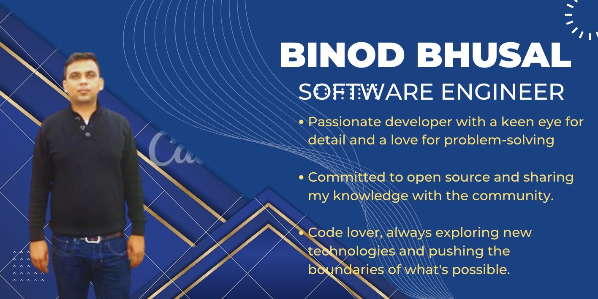

<h1 align="center">Hi 👋, I'm Binod Bhusal </h1>

---

  

I am full stack passionate developer with  impressive IT credentials, a keen eye for detail and a love for problem-solving. I am constantly striving to improve my skills and embrace new technologies. When I'm not coding, you can find me hiking in the great outdoors or immersed in a good book. I also spend time on transcendental meditation to sustain my awareness and productivity. Let's build something great together!
 
 🔭 I’m planning for a Project: Web3 based Fintech Web App with integration of ML and AI.
 
 🌱  🌱 I’m currently learning : Solidity
 
 👯 I’m looking to collaborate for a Fintech and ML-based project.
 
 💬 Ask me about Full Stack Development, Meditation, and any Tech-related stuff.
- ⚡ I'm currently available for new opportunities please feel free to reach out to me.
  
---

## Connect with me

  

  
 

## ✨ Skills
### Front-end Languages & Frameworks

  
 
 
 
 
  
 
 

### Back-end Language

  
  

### Databases

 

### Other Technologies

 
 
 

