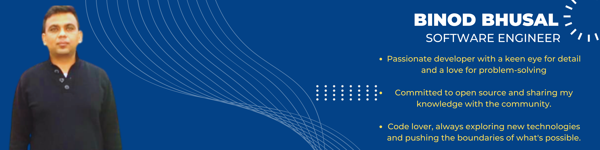

### Hey Binod here 👋

---

  

I am full stack passionate developer with  impressive IT credentials, a keen eye for detail and a love for problem-solving. I am constantly striving to improve my skills and embrace new technologies. When I'm not coding, you can find me hiking in the great outdoors or immersed in a good book. I also spend time on transcendental meditation to sustain my awareness and productivity. Let's build something great together!
 
 🔭 I’m planning for a Project: Web3 based Fintech Web App with integration of ML and AI.
 
 🌱 I’m currently learning : Ruby on Rails
 
 🌱 I want to learn:  Solidity  for Web3 
 
 👯 I’m looking to collaborate on a Fintech and ML-based project.
 
 💬 Ask me about Full Stack Development, Meditation, and any Tech-related stuff.

---

### Tech & Tools Preference
## Languages

## Other Languages I know
 Ruby on Rails

## Tools:

  

  

## Frameworks:

## Reach Out to me:

